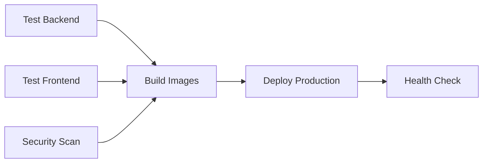

# GitHub Actions CI/CD Pipeline Dokümantasyonu

Bu dokümantasyon, Teşvik360 projesi için oluşturulan GitHub Actions CI/CD pipeline'larını açıklar.

## 📋 İçindekiler

- [Genel Bakış](#genel-bakış)
- [Workflow'lar](#workflowlar)
- [Kurulum](#kurulum)
- [Kullanım](#kullanım)
- [Troubleshooting](#troubleshooting)
- [Best Practices](#best-practices)

## 🎯 Genel Bakış

Teşvik360 projesi için aşağıdaki CI/CD pipeline'ları oluşturulmuştur:

### 🔄 Otomatik Tetiklenen Workflow'lar

1. **Main Branch Push** → Production Deployment
2. **Develop Branch Push** → Staging Deployment  
3. **Pull Request** → Code Quality Check
4. **Tag Push (v*.*.*)** → Release Creation

### 🎮 Manuel Tetiklenen Workflow'lar

1. **Production Deployment** → Manuel production deploy
2. **Docker Build** → Manuel image build
3. **Secrets Verification** → Konfigürasyon kontrolü

## 📁 Workflow'lar

### 1. CI/CD Pipeline (`ci-cd.yml`)

**Tetikleyiciler:**
- `push` to `main`, `develop`
- `pull_request` to `main`

**İşlemler:**


**Özellikler:**
- ✅ Backend ve frontend testleri
- ✅ Güvenlik taraması (Trivy)
- ✅ Docker image build ve push
- ✅ Zero-downtime deployment
- ✅ Otomatik rollback
- ✅ Health check

### 2. Pull Request Check (`pr-check.yml`)

**Tetikleyiciler:**
- `pull_request` to `main`, `develop`

**Kontroller:**
- 🔍 Code quality (linting, formatting)
- 🔒 Dependency security audit
- 🏗️ Build test
- 📊 PR size analysis
- 💬 Otomatik PR yorumu

### 3. Release Workflow (`release.yml`)

**Tetikleyiciler:**
- `push` tag `v*`

**İşlemler:**
- 📦 Release oluşturma
- 🏷️ Multi-tag Docker images
- 📄 Deployment package
- 🚀 Production deployment (stable releases)

### 4. Docker Build (`docker-build.yml`)

**Reusable workflow** - Diğer workflow'lar tarafından kullanılır

**Özellikler:**
- 🏗️ Multi-platform builds (amd64, arm64)
- 📋 SBOM generation
- 🔒 Image signing (production)
- 💾 Build cache optimization

### 5. Production Deployment (`deploy-production.yml`)

**Manuel tetikleme** - Production deployment kontrolü

**Özellikler:**
- ✅ Pre-deployment checks
- 💾 Otomatik backup
- 🚀 Zero-downtime deployment
- 🏥 Post-deployment verification
- 🔄 Rollback capability

### 6. Staging Deployment (`staging-deploy.yml`)

**Tetikleyiciler:**
- `push` to `develop`
- Manuel tetikleme

**Özellikler:**
- 🎭 Staging environment deployment
- 🧪 Integration tests
- 📊 Deployment summary

### 7. Secrets Verification (`setup-secrets.yml`)

**Manuel tetikleme** - Konfigürasyon doğrulama

**Kontroller:**
- 🔐 Required secrets
- 🔌 SSH connection
- 🌐 URL accessibility
- 📋 Setup report

## 🚀 Kurulum

### 1. Repository Hazırlığı

```bash
# Workflow dosyalarını repository'ye ekle
git add .github/workflows/
git commit -m "feat: add GitHub Actions CI/CD workflows"
git push origin main
```

### 2. Secrets Konfigürasyonu

**Repository Settings > Secrets and variables > Actions**

#### Zorunlu Secrets:
```bash
DEPLOY_SSH_KEY          # Production SSH private key
DEPLOY_HOST             # Production server IP/domain
DEPLOY_USER             # SSH username
DEPLOY_PATH             # Application directory
DEPLOY_URL              # Production URL
```

#### Opsiyonel Secrets:
```bash
STAGING_SSH_KEY         # Staging SSH key
STAGING_HOST            # Staging server
STAGING_USER            # Staging username
STAGING_PATH            # Staging directory
STAGING_URL             # Staging URL
```

### 3. Environment Konfigürasyonu

**Repository Settings > Environments**

#### Production Environment:
- ✅ Protection rules: Required reviewers
- ✅ Branch restrictions: `main` only
- 🔐 Environment secrets

#### Staging Environment:
- ✅ Branch restrictions: `develop`, `staging`
- 🔐 Environment secrets

### 4. Kurulum Doğrulama

```bash
# GitHub Actions > Verify Secrets Setup > Run workflow
# ✅ Check production secrets
# ✅ Test SSH connection
# ✅ Verify server setup
```

## 🎮 Kullanım

### Otomatik Deployment

#### Production Deployment:
```bash
# Main branch'e push yap
git checkout main
git merge develop
git push origin main
# → Otomatik production deployment tetiklenir
```

#### Staging Deployment:
```bash
# Develop branch'e push yap
git checkout develop
git push origin develop
# → Otomatik staging deployment tetiklenir
```

### Manuel Deployment

#### Production:
1. **GitHub > Actions > Deploy to Production**
2. **Run workflow** butonuna tıkla
3. **Version** seç (main, tag, veya branch)
4. **Options** ayarla (backup, rollback)
5. **Run workflow** ile başlat

#### Rollback:
1. **GitHub > Actions > Deploy to Production**
2. **Run workflow** butonuna tıkla
3. **Rollback** seçeneğini aktifleştir
4. **Run workflow** ile başlat

### Release Oluşturma

```bash
# Version tag oluştur ve push et
git tag v1.0.0
git push origin v1.0.0
# → Release workflow otomatik tetiklenir
```

### Docker Image Build

```bash
# Manuel image build
# GitHub > Actions > Docker Build and Push > Run workflow
# Environment: production/staging/development
# Tag: latest/custom-tag
# Push images: true/false
```

## 🔍 Monitoring ve Logs

### Workflow Status

**GitHub > Actions** sekmesinde tüm workflow'ların durumunu görebilirsiniz:

- 🟢 **Success**: Başarılı
- 🔴 **Failure**: Başarısız  
- 🟡 **In Progress**: Devam ediyor
- ⚪ **Cancelled**: İptal edildi

### Log İnceleme

1. **Actions** sekmesine git
2. İncelemek istediğin **workflow run**'a tıkla
3. **Job**'a tıkla
4. **Step**'leri genişlet ve logları incele

### Deployment Status

```bash
# Production health check
curl https://tesvik360.com/api/health

# Staging health check  
curl https://staging.tesvik360.com/api/health
```

## 🚨 Troubleshooting

### Yaygın Sorunlar

#### 1. SSH Connection Failed
```bash
# Çözüm:
# 1. SSH key'in doğru olduğunu kontrol et
# 2. Server erişimini test et
# 3. User permissions'ları kontrol et

# Test:
ssh -i ~/.ssh/key user@server "echo 'test'"
```

#### 2. Docker Build Failed
```bash
# Çözüm:
# 1. Dockerfile syntax'ını kontrol et
# 2. Dependencies'leri kontrol et
# 3. Build context'i kontrol et

# Test:
docker build -t test ./backend
docker build -t test ./web
```

#### 3. Deployment Failed
```bash
# Çözüm:
# 1. Server disk space'ini kontrol et
# 2. Docker service'ini kontrol et
# 3. Environment variables'ları kontrol et

# Test:
df -h                    # Disk space
systemctl status docker  # Docker service
docker-compose config    # Config validation
```

#### 4. Health Check Failed
```bash
# Çözüm:
# 1. Service'lerin çalıştığını kontrol et
# 2. Port'ların açık olduğunu kontrol et
# 3. Network connectivity'yi kontrol et

# Test:
docker-compose ps        # Service status
netstat -tlnp | grep 80 # Port check
curl localhost/api/health # Local health check
```

### Debug Workflow

```yaml
# Workflow'a debug step ekle
- name: Debug Information
  run: |
    echo "Current directory: $(pwd)"
    echo "Environment: $NODE_ENV"
    echo "Available space: $(df -h)"
    echo "Docker version: $(docker --version)"
    echo "Docker images: $(docker images)"
```

### Log Collection

```bash
# Server'da log toplama
cd /opt/tesvik360

# Application logs
docker-compose -f docker-compose.prod.yml logs backend
docker-compose -f docker-compose.prod.yml logs frontend

# System logs
journalctl -u docker
tail -f /var/log/nginx/access.log
```

## 🎯 Best Practices

### 1. Branch Strategy

```bash
# Feature development
feature/new-feature → develop → staging

# Release preparation  
develop → release/v1.0.0 → main → production

# Hotfixes
hotfix/critical-fix → main → production
```

### 2. Commit Messages

```bash
# Conventional commits kullan
feat: add user authentication
fix: resolve database connection issue
docs: update deployment guide
chore: update dependencies
```

### 3. Testing Strategy

```bash
# Local testing
npm test                 # Unit tests
npm run test:integration # Integration tests
npm run test:e2e        # End-to-end tests

# CI testing
# → Unit tests (her commit)
# → Integration tests (PR)
# → E2E tests (staging deployment)
```

### 4. Security

```bash
# Secrets management
# ✅ Use GitHub Secrets
# ❌ Never commit secrets to code

# Image security
# ✅ Regular security scans
# ✅ Minimal base images
# ✅ Multi-stage builds
```

### 5. Performance

```bash
# Build optimization
# ✅ Docker layer caching
# ✅ Multi-platform builds
# ✅ Parallel jobs

# Deployment optimization
# ✅ Zero-downtime deployment
# ✅ Health checks
# ✅ Rollback capability
```

## 📊 Metrics ve Monitoring

### Deployment Metrics

- **Deployment Frequency**: Her main push
- **Lead Time**: Code commit → Production
- **MTTR**: Mean Time To Recovery
- **Change Failure Rate**: Failed deployments %

### Monitoring Tools

```bash
# GitHub Actions insights
# Repository > Insights > Actions

# Custom monitoring
# Prometheus + Grafana
# Application logs
# Infrastructure monitoring
```

## 🔗 İlgili Dokümantasyon

- [Secrets Setup Guide](.github/SECRETS.md)
- [Production Deployment](DEPLOYMENT.md)
- [Production README](README-PRODUCTION.md)
- [Docker Configuration](docker-compose.prod.yml)

## 📞 Destek

Sorun yaşadığınızda:

1. **Workflow logs**'ları inceleyin
2. **Troubleshooting** bölümünü kontrol edin
3. **GitHub Issues** oluşturun
4. **Team lead**'e ulaşın

---

**Son Güncelleme:** $(date)
**Versiyon:** 1.0.0